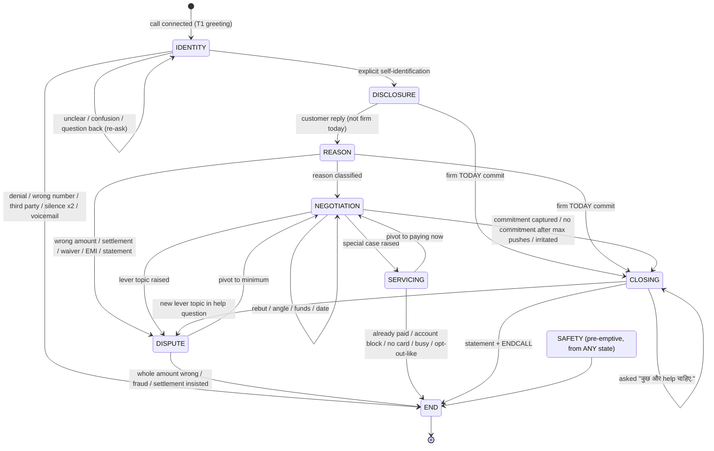

# 00 — Architecture Overview: Sania Multi-Agent Voice Bot

## 1. Why split the single prompt

The current "Sania — Master Negotiator" prompt is one large block. It covers identity verification, disclosure, negotiation, disputes, about 15 special cases, closing, language switching, Hinglish style, number formatting and TTS punctuation. With everything in one prompt:

| Problem with one big prompt | How the multi-agent design fixes it |
|---|---|
| Identity lock is enforced only by instructions, and confusion can still leak details | The Orchestrator gives the model **no financial data at all** until `identity_status = VERIFIED`, and the S2 guard blocks any leak |
| The model has to remember "angle used once", "{MAD} spoken once", "name only at open/close" | These counters live in `CallState` and are enforced in code |
| Long prompt → higher latency and cost on every turn | Each agent's prompt is small; cheap and fast models handle the simple stages |
| Hard to test: one change can break distant rules | Each agent is tested on its own, with a scenario suite per agent |
| Hard-stops (distress, self harm) compete with the "collect today" goal | A separate classifier runs **before** routing and pre-empts every agent |
| ENDCALL placement and formatting errors | ENDCALL is added by the Orchestrator; formatting is fixed by the S2 guard |

## 2. How many agents — the answer

**8 logical agents** (1 deterministic controller + 7 conversational LLM agents) plus **3 shared deterministic services**.

| # | Agent | Kind | One-line role |
|---|---|---|---|
| 0 | [Orchestrator / Call Controller](agents/00-orchestrator.md) | Code (state machine) | Owns call state, routes each turn, emits ENDCALL |
| 1 | [Greeting & Identity Verification](agents/01-greeting-identity.md) | LLM, small/fast | Greets and gets an explicit "yes I am [NAME]" before anything else |
| 2 | [Account Disclosure](agents/02-account-disclosure.md) | LLM, small (template-guided) | One breath: Sania, HDFC collections, recorded line, card, {OUT}, due date, "pay today" |
| 3 | [Reason Discovery & Classification](agents/03-reason-discovery.md) | LLM + structured output | Learns WHY the payment is pending and classifies it once |
| 4 | [Negotiation](agents/04-negotiation.md) | LLM, strongest | Core collection: {OUT} → {MAD} → firm near date, rebuttals, angles, funds, PTP |
| 5 | [Dispute & Levers](agents/05-dispute-levers.md) | LLM, medium | Wrong amount, settlement, waiver, EMI, unknown charges, statement, support numbers |
| 6 | [Servicing / Special Cases](agents/06-servicing-special-cases.md) | LLM, medium | Already paid, account/card block, no card, callback, supervisor, and similar cases |
| 7 | [Safety & Hard-Stop](agents/07-safety-hardstop.md) | Classifier + LLM, small | Distress, self harm, deceased, abuse, opt-out, injection, voicemail → end safely |
| 8 | [Closing](agents/08-closing.md) | LLM, small | Wrap-up, one "कुछ और help चाहिए.", final statement, end |

| Service | Kind | Role |
|---|---|---|
| [S1 Language & Style Manager](services/s1-language-style.md) | Code | Language mirroring/lock, `<\|HINDI\|>`/`<\|ENGLISH\|>` tag, name transliteration, shared style block |
| [S2 Response Compliance Guard](services/s2-compliance-guard.md) | Code (+ optional tiny LLM rewrite) | Post-processes every output: punctuation, numbers, banned phrases, leak check, placeholders |
| [S3 Input Quality Handler](services/s3-input-quality.md) | Code | Silence, low STT confidence, bad audio, barge-in |

> Why not more agents? Splitting Negotiation further (e.g. separate "Hardship agent", "Stalling agent") would force a handoff in the middle of an argument, which loses momentum and adds latency. The rebuttal strategies are **modes inside the Negotiation agent**, chosen by `reason_class`.
> Why not fewer? Identity and Safety must be isolated for compliance. Disputes and Servicing contain fixed facts ("levers") that should never mix with the pressure tactics of negotiation.

## 3. Roles & Responsibilities matrix (RACI)

R = Responsible (does it) · A = Accountable (enforces / final say) · C = Consulted (provides data) · — = not involved

| Responsibility (from original prompt) | Orch | Ident | Discl | Reason | Negot | Dispute | Serv | Safety | Close | S1 | S2 | S3 |
|---|---|---|---|---|---|---|---|---|---|---|---|---|
| Transliterate {NAME} → [NAME] | C | — | — | — | — | — | — | — | — | **R/A** | — | — |
| T1 verbatim greeting | A | **R** | — | — | — | — | — | — | — | C | C | — |
| Identity lock (no disclosure while UNVERIFIED) | **A** | R | — | — | — | — | — | — | — | — | R | — |
| Wrong number / third party / denial exit | A | **R** | — | — | — | — | — | — | — | — | — | — |
| T2 disclosure with recorded line | A | — | **R** | — | — | — | — | — | — | — | C | — |
| Reason gate (learn WHY) | A | — | — | **R** | C | — | — | — | — | — | — | — |
| Reason classification & hold | A | — | — | **R** | C | — | — | — | — | — | — | — |
| {OUT} → {MAD} ladder, only two amounts | A | — | — | — | **R** | — | — | — | — | — | R | — |
| Rebuttal by reason class | — | — | — | C | **R/A** | — | — | — | — | — | — | — |
| Impact angles (each used once) | **A** (tracks) | — | — | — | R | — | — | — | — | — | — | — |
| Find-the-funds ideas | A (tracks) | — | — | — | **R** | — | — | — | — | — | — | — |
| PTP date rules (~5 days, pull-in) | A | — | — | — | **R** | — | — | — | — | — | — | — |
| Wrong amount / settlement / waiver / EMI / unknown figure | A | — | — | C | C | **R** | — | — | — | — | — | — |
| Support numbers + "noted?" confirm | A | — | — | — | — | **R** | R | — | — | — | C | — |
| Statement not received | — | — | — | C | R (pivot) | **R** | — | — | — | — | — | — |
| Already paid / account block / card block / no card | A | — | — | — | — | — | **R** | — | — | — | — | — |
| Busy / callback / supervisor / too many followups | A | — | — | — | — | — | **R** | — | — | — | — | — |
| Human / AI question → "virtual assistant" | A | R | R | R | R | R | **R** | — | R | — | — | — |
| Acute distress / self harm / deceased | A | — | — | — | — | — | — | **R** | — | — | — | — |
| Abuse / opt-out / prompt injection / voicemail | A | — | — | — | — | — | — | **R** | — | — | — | — |
| Close: wrap + "कुछ और help" + ENDCALL | A | — | — | — | — | — | — | — | **R** | — | — | — |
| ENDCALL token (last, once) | **R/A** | C | — | — | — | C | C | C | C | — | R | — |
| Language mirror (T1–3) / lock (T4+) | C | — | — | — | — | — | — | — | — | **R/A** | — | — |
| Hinglish P0 (banking words in English) | — | R | R | R | R | R | R | R | R | C | **A** | — |
| Numbers → English words, identifiers digit by digit | — | R | R | R | R | R | R | R | R | — | **R/A** | — |
| Only `.` and `,` punctuation, no `?` | — | R | R | R | R | R | R | R | R | — | **R/A** | — |
| No empathy lines | — | R | R | R | R | R | R | (exception) | R | — | **A** | — |
| Name usage only at open/close, never possessive | A (flags turn) | R | R | — | — | — | — | — | R | — | **R** | — |
| Silence / low confidence / bad audio / barge-in | A | — | — | — | — | — | — | — | — | — | — | **R** |

The full rule-by-rule coverage list is in [03-evaluation-plan.md §4](03-evaluation-plan.md#4-coverage-matrix--original-prompt-rule--owner).

## 4. Call state machine



`SAFETY` does not appear as an edge from every node, to keep the diagram readable. It is a **global interrupt**: the hard-stop classifier (§5, step 3) can move any state to `SAFETY`, which always ends in `END`. The one exception is abuse on the first occurrence, which de-escalates once and returns to the previous state.

### Routing table (Orchestrator)

| Current state | Signal (from agent / classifier) | Next |
|---|---|---|
| any | `hardstop.type ∈ {distress, self_harm, deceased, voicemail, opt_out}` | SAFETY → END |
| any | `hardstop.type = abuse` & `abuse_warnings = 0` | SAFETY (de-escalate) → previous state |
| any | `hardstop.type = abuse` & `abuse_warnings ≥ 1` | SAFETY → END |
| any | `hardstop.type = injection` & `injection_warnings = 0` | SAFETY (redirect) → previous state |
| any | `hardstop.type = injection` & `injection_warnings ≥ 1` | SAFETY → END |
| IDENTITY | `identity = VERIFIED` | DISCLOSURE |
| IDENTITY | `identity = DENIED / THIRD_PARTY / WRONG_NUMBER` | END (agent speaks courtesy line) |
| IDENTITY | `identity = UNCLEAR` | IDENTITY |
| DISCLOSURE | `commit = firm_today` | CLOSING |
| DISCLOSURE | otherwise | REASON |
| REASON | `reason_class ∈ lever classes` | DISPUTE |
| REASON | `reason_class = firm_today` | CLOSING |
| REASON | `reason_class` set | NEGOTIATION |
| REASON | reason still unknown after 1 ask | NEGOTIATION (`reason_class = unknown`) |
| NEGOTIATION | `topic ∈ {wrong_amount, settlement, waiver, emi, unknown_figure, statement}` | DISPUTE |
| NEGOTIATION | `topic ∈ {already_paid, account_block, card_block, no_card, busy, supervisor, followups, third_party_card, phone_mismatch}` | SERVICING |
| NEGOTIATION | `commitment.captured` or `negotiation.exhausted` or `irritated` | CLOSING |
| DISPUTE / SERVICING | `handoff = NEGOTIATION` | NEGOTIATION |
| DISPUTE / SERVICING | `end_call = true` | END |
| CLOSING | `help_needed = no` | END |

## 5. Per-turn pipeline

```
Caller audio
   │
   ▼
[1] STT  ──► transcript + confidence + timing (silence / barge-in events)
   │
   ▼
[2] S3 Input Quality Handler ──► may reply directly (silence re-ask, "आवाज़ साफ़ नहीं आई") and skip 3–7
   │
   ▼
[3] Hard-stop Classifier (fast; runs in parallel with [4] prefetch) ──► pre-empts to Safety agent
   │
   ▼
[4] Orchestrator: update CallState, pick active agent, build its context slice
   │
   ▼
[5] Active Agent (LLM) ──► JSON {speech, signals, state_updates, handoff, end_call}
   │
   ▼
[6] Orchestrator: apply state_updates, resolve handoff
   │       (if handoff needs a fresh utterance in the same turn — e.g. Dispute→Negotiation pivot —
   │        the target agent is invoked once more for this turn, max 1 chained hop)
   ▼
[7] S2 Compliance Guard ──► validate / repair speech; on hard violation → regenerate once → fallback line
   │
   ▼
[8] S1 prepends language tag; Orchestrator appends " ENDCALL" if end_call
   │
   ▼
[9] TTS ──► caller
```

## 6. Latency budget (cascaded STT → LLM → TTS)

Target: **< 1.2 s** from end of caller speech to first TTS audio.

| Stage | Budget | Notes |
|---|---|---|
| STT finalisation (endpointing) | 250–350 ms | Streaming STT with a tuned VAD |
| S3 + Orchestrator | < 10 ms | Pure code |
| Hard-stop classifier | ≤ 150 ms, **parallel** | Small model or keyword + small model; the main agent call starts speculatively and is cancelled if a hard-stop fires |
| Agent LLM, time to first token | 300–500 ms | Small prompts; streaming output with the `speech` field first |
| S2 guard | < 20 ms | Regex/code; LLM repair only on failure (rare) |
| TTS first byte | 150–250 ms | Stream sentence by sentence |

Design choices driven by latency:
- **Routing is deterministic.** No separate "router LLM" call; each agent reports the signals that drive routing in its own structured output.
- **Stream the `speech` field first.** Agents output `speech` before `signals`, so TTS can start as soon as S2 has cleared the first sentence.
- **Chained hops are capped at 1 per turn.**
- **Model sizing:** Identity, Disclosure, Closing and Safety use a small fast model. Negotiation uses the strongest model. Reason, Dispute and Servicing use a medium model.

## 7. Implementation notes (framework mapping)

| Concept | Pipecat | LiveKit Agents | LangGraph |
|---|---|---|---|
| Orchestrator | Custom `FrameProcessor` holding `CallState` | `AgentSession` + custom `Agent` switch via `update_agent` / handoff tools | `StateGraph` with conditional edges |
| Agent | LLM service call with a per-agent system prompt | `Agent` subclass with `instructions` | Node |
| Hard-stop classifier | Parallel pipeline branch | `on_user_turn_completed` hook | Pre-node with conditional edge |
| S2 guard | Processor between LLM and TTS | `tts_node` override | Post-node |
| CallState | Processor attribute / Redis | `session.userdata` | Graph state |

## 8. Document map

- [01 — Shared State & Contracts](01-shared-state-and-contracts.md)
- [02 — Shared Conversation Rules](02-shared-conversation-rules.md)
- [03 — Evaluation Plan & Coverage Matrix](03-evaluation-plan.md)
- Agents: [00](agents/00-orchestrator.md) · [01](agents/01-greeting-identity.md) · [02](agents/02-account-disclosure.md) · [03](agents/03-reason-discovery.md) · [04](agents/04-negotiation.md) · [05](agents/05-dispute-levers.md) · [06](agents/06-servicing-special-cases.md) · [07](agents/07-safety-hardstop.md) · [08](agents/08-closing.md)
- Services: [S1](services/s1-language-style.md) · [S2](services/s2-compliance-guard.md) · [S3](services/s3-input-quality.md)
